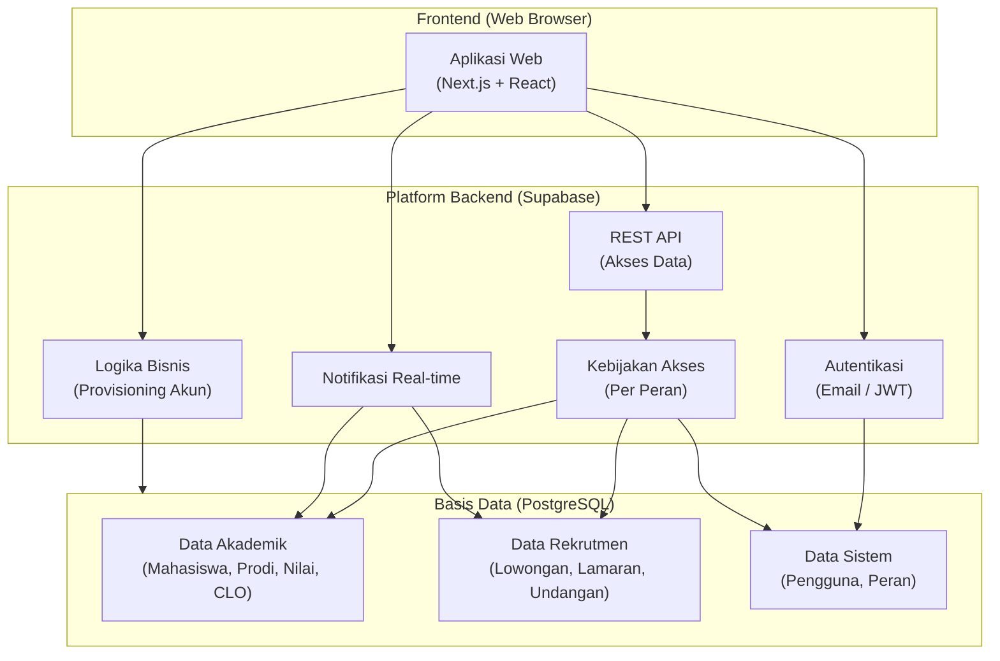
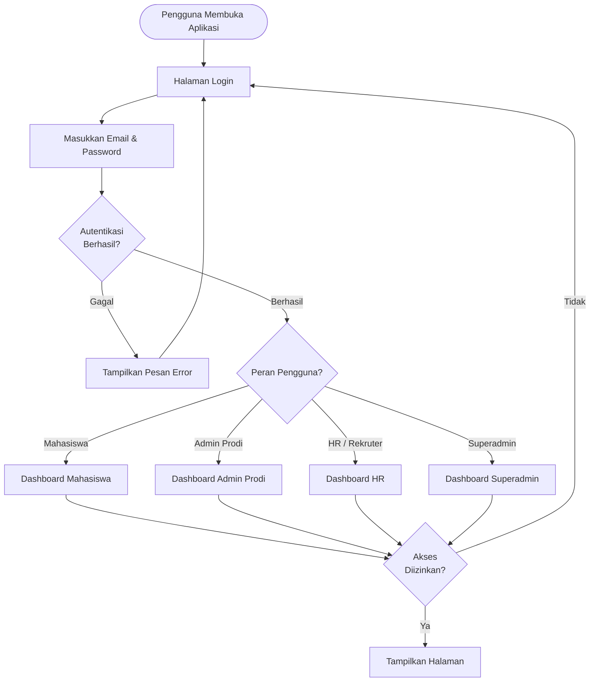
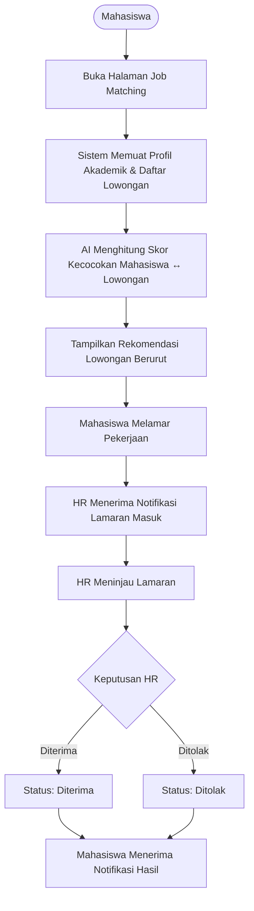
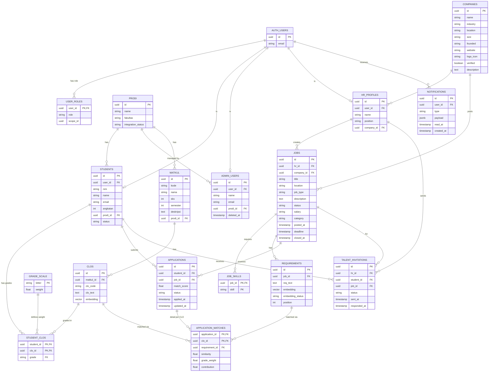
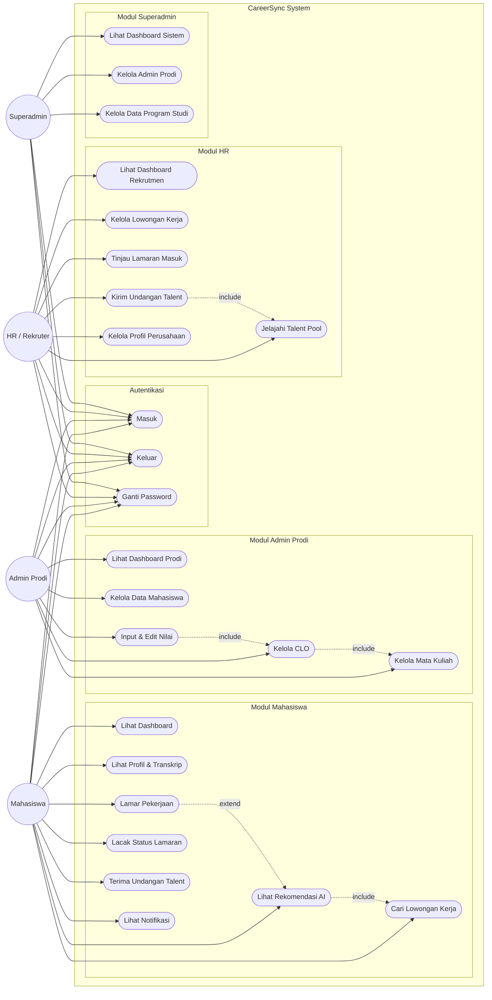

# CareerSync — System Diagrams

> Render dengan VS Code extension **Markdown Preview Mermaid Support** atau paste ke [mermaid.live](https://mermaid.live).

---

## 1. Architecture Diagram

---

## 2. Flowchart — Autentikasi & Routing Peran

---

## 3. Flowchart — Job Matching & Lamaran

---

## 4. ERD (Entity Relationship Diagram)

---

## 5. Use Case Diagram

---

## Cara Render

| Diagram | Tool |
|---------|------|
| Semua diagram | VS Code: install **Markdown Preview Mermaid Support** lalu buka Preview |
| Semua diagram | [mermaid.live](https://mermaid.live) — paste isi blok kode |
| Semua diagram (alternatif) | [draw.io](https://draw.io) — bisa import Mermaid langsung |
